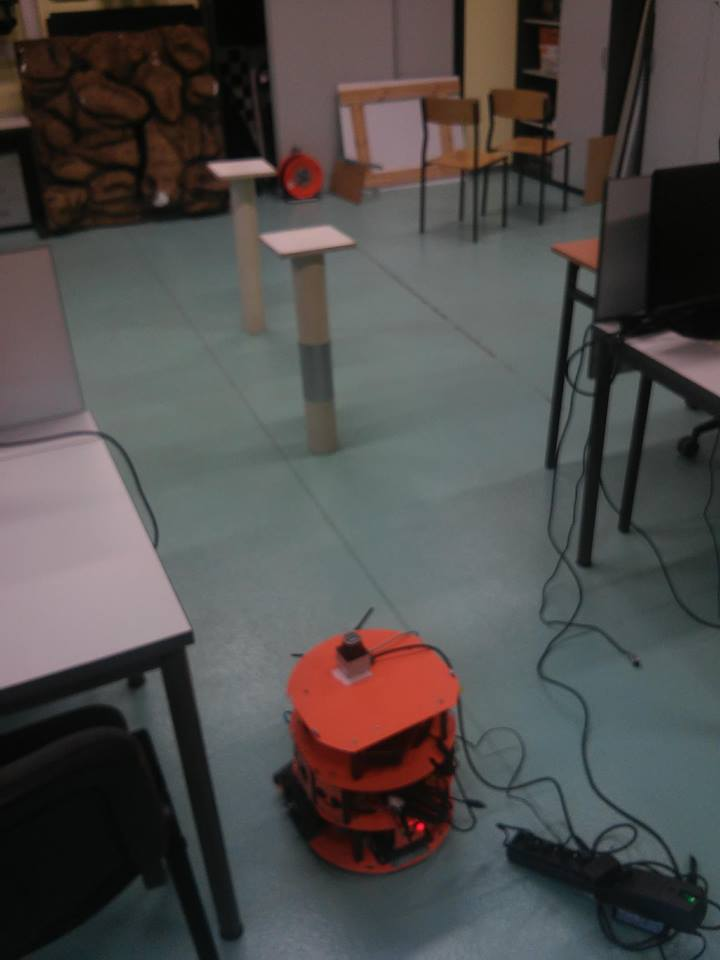

# autonomous-rea
The following application provides utilities for an autonomous mobile platform and integrates its multiple sensors. The robot can be controlled with usage of XBOX Controller or autonomous driving algorithm. Hokuyo laser scanner provides a representation of 2D surface.  The robot uses Hector SLAM for building 2D representation of an environment. All available ros topics can be easily accessed in Rviz.

## How to start

In order to run this application you must follow these steps:

* Build the whole workspace by executing **catkin_make** command
* Run **source devel/setup.bash** command
* Run **rosrun urg_node urg_node** command
* Run **roslaunch ./autonomous_hokuyo/launch/autonomous.launch**
* Run **roslaunch labbot hector_mapping.launch**

If you want to get an occupancy map built by Hector Slam you should do the following:
* Run **apt-get install ros-kinetic-hector-slam**
* Run **roslaunch turtlebot_gazebo hector_mapping.launch**

## Fixed bugs
* By default there is no possibility to run urg_node with labbot odometry as urg_node tries to read a device from /dev/ttyACM0 which is already used by labbot motors. Therefore we changed the default read device in urg_node's source code.
* We've changed the sign of values returned by labbot odometry since they were twisted in some axes

